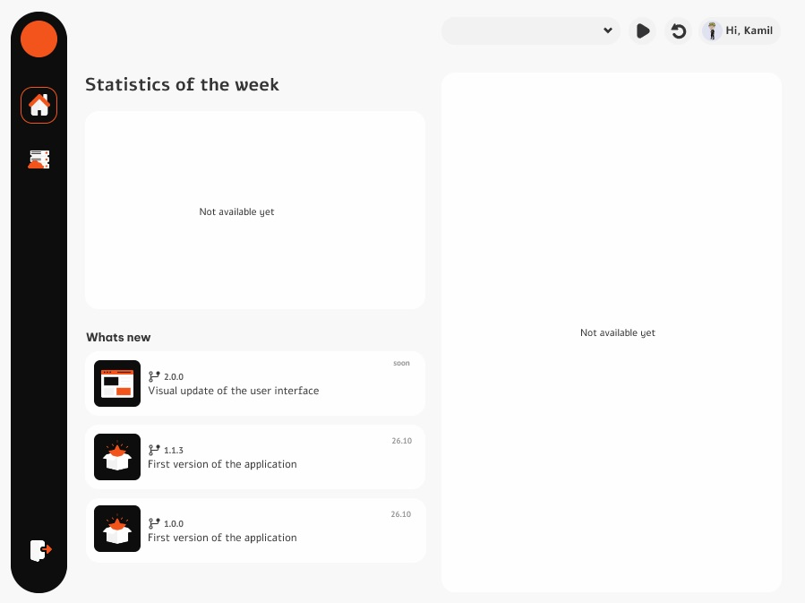

<h1 align="center">TiCloud - Your personal productivity assistant</h1>

<p align="center">
  <a href="https://github.com/kamilkalarus">Kamil Kalarus</a>
</p>

TiCloud is a desktop application for monitoring and managing time spent working on software projects. The main purpose of the application is to help users track work sessions, organise projects and analyse the time spent on different tasks.

<h6>
  <p align="center">
    
    <br/><em>Appearance of the application window in version 2.0.0<sup>1</sup> </em>
  </p>
</h6>

><sup>1</sup> _The image shows an unreleased version of the application and its appearance may differ from the design_<br>

## News
- 2025-03-XX: Second version of TiCloud with revised and improved graphical menus
- 2025-02-29: [Hotfix](https://github.com/Kalkalax/TiCloud/archive/refs/tags/v1.1.3.zip) (time display fix)
- 2024-12-29: [First version of TiCloud](https://github.com/Kalkalax/TiCloud/archive/refs/tags/v1.0.0.zip) with simple visual menu


## Roadmap
- [ ] Development of the visual side of the application
- [ ] Adding tasks to a work session 
- [ ] Securing the veracity of collected data Blockchain technology
- [ ] Possibility of generating reports (weekly/monthly/annually)
- [ ] Integration with the GitHub platform 

## Installation

> If you are not a developer and just want to use the application, just download the latest application installer. 
Always download the `.zip` file with the latest version of the installer to get all the latest features and bug fixes.

### System requirements
- Windows 11 Home 23H2+


### Using the ready-made `.exe` app installation wizard (_installers_)
To install the application, download the contents of the _installers_ branch. 

They can be downloaded using Git Bash:
  ```bash
  git clone --branch installers --single-branch https://github.com/Kalkalax/TiCloud
  ```
or , just [download the latest application installer (1.1.3)](https://github.com/Kalkalax/TiCloud/archive/refs/tags/v1.1.3.zip).

Then follow the instructions below:

- if you downloaded the `.zip` archive extract all the contents to one location,
- run `setup.exe`,
- follow the instructions of the installation wizard.

### Advanced installation (for developers)

If you are interested in the source code or want to introduce your own implementation, use the instructions below.

<details>
<summary>Read more</summary>
<br>

Each branch contains different content and, depending on your preferences, you can get applications in several ways:
- `installers`<sup>2</sup> - contains an application installer that will guide you through the entire process
- `release`<sup>3</sup> - contains the application code along with the version of the VS project that was used to create the application installer 
- `master` - contains the stable source code of the application along with the VS project which has not yet been released or is part of a future version 
- `develop`<sup>4</sup> - contains the source code of the application along with the VS project which is in continuous development along with the necessary documentation 

### Acquiring a Git repository
The repository can be obtained in two ways:
- Cloning a Git repository:

  - To download the entire repository, run Git Bash on the target location and call:

    ```bash
    git clone https://github.com/Kalkalax/TiCloud
    ```

- Downloading the archive `.ZIP`<sup>5</sup>:

  - [installers](https://github.com/Kalkalax/TiCloud/archive/refs/heads/installers.zip) 
  - [release](https://github.com/Kalkalax/TiCloud/archive/refs/heads/release.zip) 
  - [master](https://github.com/Kalkalax/TiCloud/archive/refs/heads/master.zip)
  - [develop](https://github.com/Kalkalax/TiCloud/archive/refs/heads/develop.zip)


### Documentation

- [Development documentation]() (_currently unavailable_)
<br><br>

><sup>2</sup> _recommended for users who only want to use the application's capabilities_<br>
><sup>3</sup> _wersja programu na której dokonywane są poprawki błędów wydanej wersji, w pełni funkcjonalna_<br>
><sup>4</sup> _application code may not be stable or not work at all, may contain elements not present in other branches_<br>
><sup>5</sup> _each branch must be downloaded separately_<br>
</details>

## Star History

<a href="https://star-history.com/#Kalkalax/TiCloud&Date">
 <picture>
   <source media="(prefers-color-scheme: dark)" srcset="https://api.star-history.com/svg?repos=Kalkalax/TiCloud&type=Date&theme=dark" />
   <source media="(prefers-color-scheme: light)" srcset="https://api.star-history.com/svg?repos=Kalkalax/TiCloud&type=Date" />
   
 </picture>
</a>


## Contribution

<a href="https://github.com/Kalkalax/TiCloud/graphs/contributors">
  
</a>