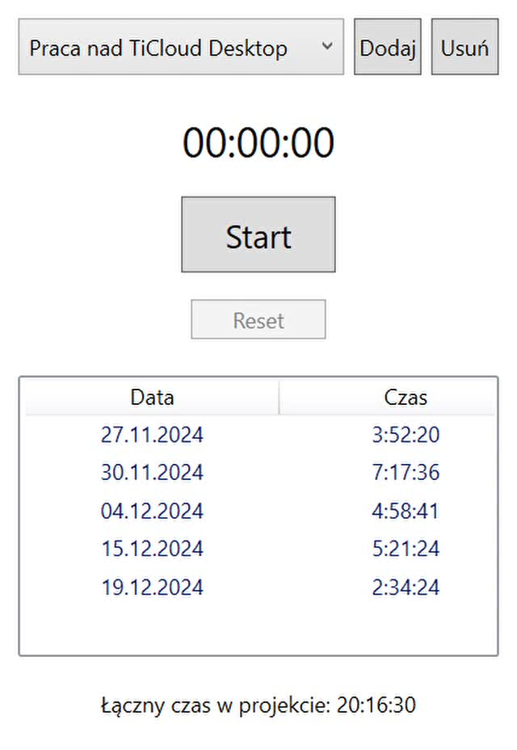
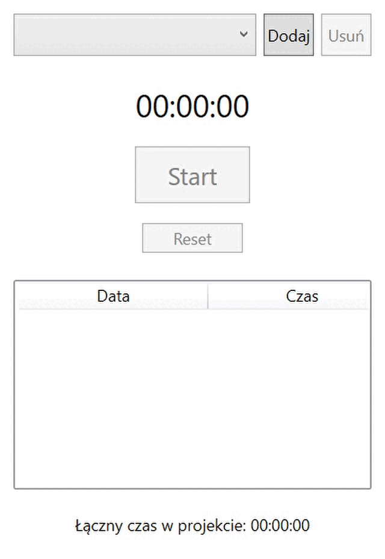

<h1 align="center">TiCloud - Your personal productivity assistant</h1>

<p align="center">
  <a href="https://github.com/kamilkalarus">Kamil Kalarus</a>
</p>

TiCloud is a desktop application for monitoring and managing time spent working on software projects. The main purpose of the application is to help users track work sessions, organise projects and analyse the time spent on different tasks.


<p align="center">
  
  
</p>

## News
- 2024-12-??: First version of TiCloud

## Features of TiCloud
- Simple and intuitive to use 
- Background work 
- Access to applications from the system tray

## Roadmap
- Development of the visual side of the application
- Adding tasks to a work session 
- Possibility of generating reports (weekly/monthly/annually)
- Integration with the GitHub platform 

## Installation

### Using the ready-made app installation wizard
To install the application, download the contents of the _relese_ branch. 

They can be downloaded using Git Bash:
```bash
git clone --branch release --single-branch https://github.com/Kalkalax/TiCloud
```
If you are not interested in cloning the repository, just [download the latest app release (1.0.0)]().

Then follow the instructions below:

- if you downloaded the `.ZIP` archive extract all the contents to one location,
- run `setup.exe`,
- follow the instructions of the installation wizard.

### Advanced installation (developers)

If you are interested in the source code or want to introduce your own implementation, use the instructions below.

<details>
  <summary>Read more</summary>
  Każdy z branchów zawiera inna zawartość i w zależności od twoich preferencji można zainstalować aplikacje na kilka sposobów:

  - `release`<sup>1</sup> - contains an application installer that will guide you through the entire process
  - `master` - contains a compiled version of the application ready to use (_without installer_)
  - `develop` - includes the source code of the application along with the VS project and the necessary documentation

  ### Acquiring a Git repository
  The repository can be obtained in two ways
  - Cloning a Git repository

    - To download the entire repository, run Git Bash on the target location and call:

    ```bash
    git clone https://github.com/Kalkalax/TiCloud
    ```

  - Downloading the archive `.ZIP`<sup>2</sup>
    - [release]() 
    - [master]()
    - [develop]()
    
 ><sup>1</sup> _recommended for users who only want to use the application's capabilities_<br>
 ><sup>2</sup> _each branch must be downloaded separately_
</details>


## Documentation

- [Development documentation]() (_currently unavailable_)


## License

[MIT License](LICENSE) © Kamil Kalarus


